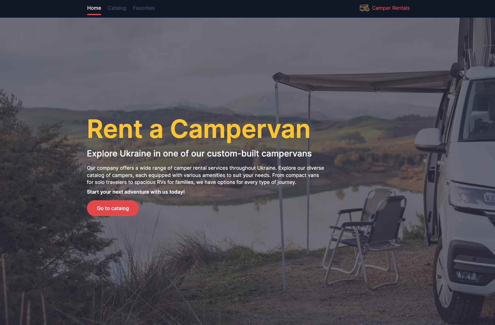
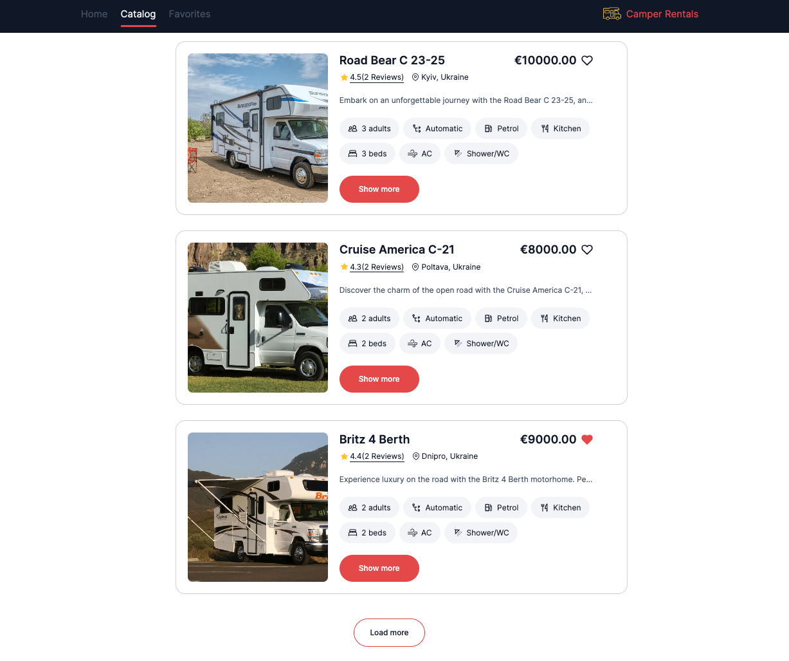
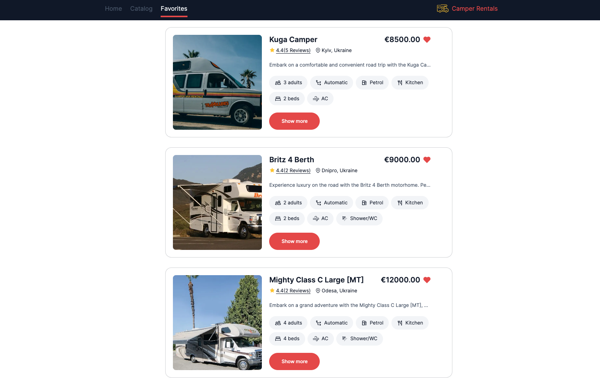
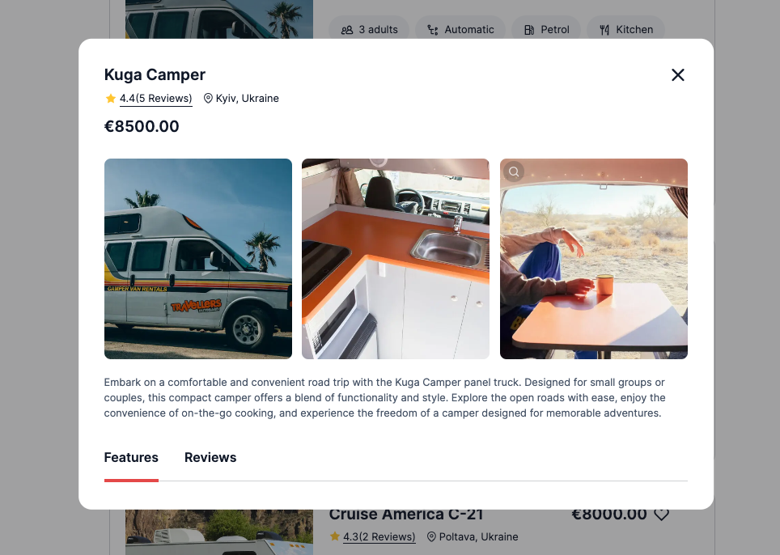
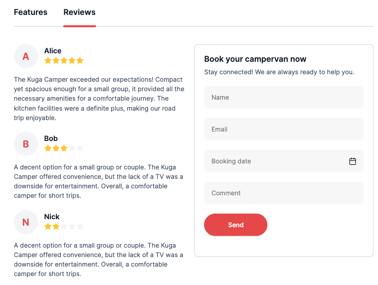
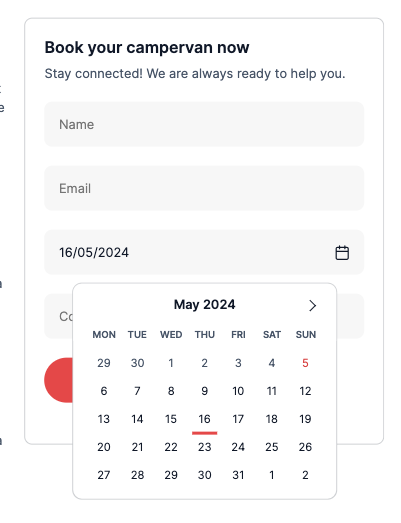
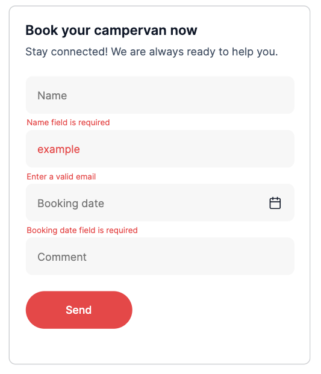

# <p>Camper Rentals</p>

<p>
   <a href="https://developer.mozilla.org/en-US/docs/Web/JavaScript"></a>
    <a href="https://react.dev/"></a>
    <a href="https://redux.js.org/"></a>
    <a href="https://redux-toolkit.js.org/"></a>
    <a href="https://redux.js.org/usage/writing-logic-thunks"></a>
    <a href="https://axios-http.com/docs/intro"></a>
    <a href="https://www.npmjs.com/package/yup"></a>
    <a href="https://formik.org/docs/overview"></a>
    <a href="https://www.npmjs.com/package/redux-persist"></a>
    <a href="https://www.npmjs.com/package/react-red"></a>
    <a href="https://www.npmjs.com/package/react-spinners"></a>
    <a href="https://www.npmjs.com/package/react-icons"></a>
</p>

---

## Description

<!-- <p style="width: 600px"> -->

"Camper Rentals" is a platform that facilitates camper rental services across
Ukraine. The website provides users with the opportunity to explore a diverse
catalog of custom-built campervans, each equipped with various amenities to suit
their travel needs. From solo travelers to families, our platform offers options
for every type of journey. Users can easily browse available campers, make
reservations, and embark on their next adventure with ease.

<!-- </p> -->



---

## Features

1. Pagination

- The website displays 4 advertisements initially on the catalog page.
- Users can load more advertisements by clicking the "Load more" button.



---

2. Favorites Functionality:

- Users can add advertisements to their favorites list by clicking the heart
  icon on the advertisement card.
- The favorites list persists even after page refresh.



---

3. Modal Window:

- Clicking the "Show more" button opens a modal window with detailed information
  about the camper.
- Information displayed in the modal window updates dynamically based on the
  active tab state.
- Users can close the modal window by clicking the close button, clicking on the
  backdrop, or pressing the Esc key.






---

4. Camper Booking:

- Seamlessly reserve a camper directly from the website with our intuitive
  booking form.
- Provide essential details such as name, email, booking date, and any
  additional comments.
- Ensure a hassle-free booking experience with client-side validation to verify
  the accuracy of entered information.





---

5. Backend Integration:

- A custom backend is set up using the UI service provided by
  https://mockapi.io/.

---

## Live page

**_<a href="https://imlaamer.github.io/camper-rentals/">Camper Rentals</a>_**

---

## Installation

To run this project, you need to install <a href="https://nodejs.org/en">Node.js
v20.12.2</a>

#### 1. Clone the project repository

```
    git clone https://github.com/imlaamer/camper-rentals.git
```

#### 2. Install dependencies

```
    npm i
```

#### 3. Start the server

```
    npm run dev
```

**_Enjoy your time and have a great experience using Camper Rentals!_**

---
